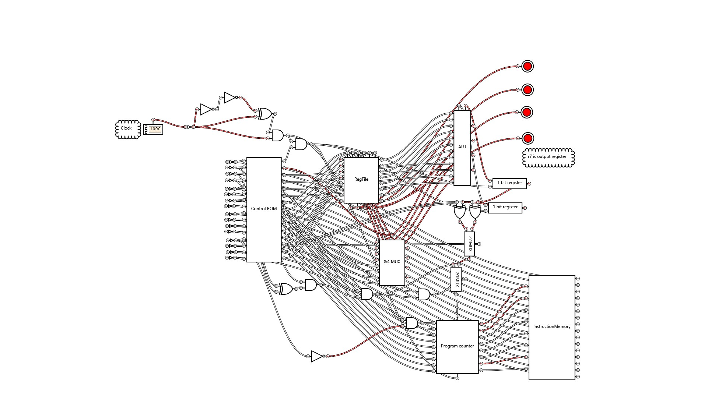

# Logic-Gate-CPU
A cpu made from scratch in Logic gate simulator: https://sourceforge.net/projects/gatesim/ complete with an ide written in python with tkinter for assembly programs. export as a gcg and open it in logic gate simulator. connect the clock to start the program. it has a light mode and dark mode

